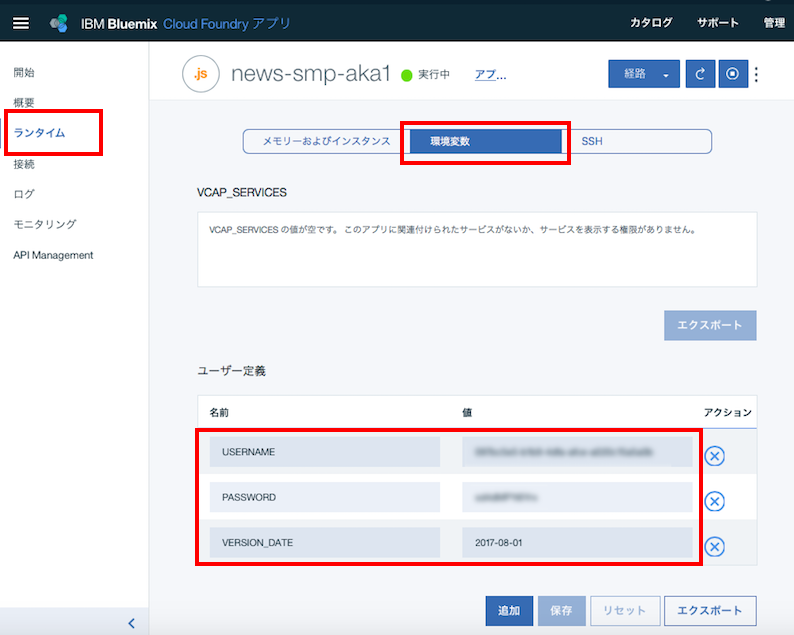

# Discovery News サンプルアプリケーション
このアプリケーションはWatson Discovery Newsの機能を簡単に確認するためのものです。  

* 次のようなことが可能です
    * 検索条件に会社名を入力し、その会社に関係するニュースの評判分析を行います
    * 検索時は、開始日、終了日を条件として指定できます
    * 検索結果は、日ごとに集計した好意的(青)、否定的(赤)、中立(黄色)の3本の折れ線グラフで表示されます
    * グラフ上の点にマウスポインタをあわせてクリックすると、評判の根拠になった記事へのリンクが右側に表示されます
    * 右側のリンクをクリックすると、元記事そのものに飛ぶことができます

デモ画面  


# Bluemix環境への自動導入
最も簡単にBluemix上にデモ環境を作りたい場合は、「自動導入」をお勧めします。  
その場合、以下の手順に従って下さい。 

## 事前準備
Bluemixアカウントを持っていない場合は [Bluemixアカウントを作る][sign_up] に従い、Bluemixアカウントを作成します。  
Bluemixアカウントを使って、 [Bluemixダッシュボード][bluemix_dashboard] を表示させて下さい。

## サービス・インスタンスの自動生成
  
- 次のボタンを押して下さい。

&nbsp;&nbsp;&nbsp;&nbsp;&nbsp;&nbsp;&nbsp;&nbsp;&nbsp;&nbsp;&nbsp;&nbsp; [](https://bluemix.net/deploy?repository=https://git.ng.bluemix.net/akaishi/discovery-news-smp)


- 下の画面が表示されたら「アプリ名」をわかりやすいものに変更し(アプリケーションのURLの一部になります) 、「デプロイ」ボタンをおします。

&nbsp;&nbsp;&nbsp;&nbsp;&nbsp;&nbsp;&nbsp;&nbsp;&nbsp;&nbsp;&nbsp;&nbsp;


* このボタンを押すことにより次の処理が自動的に行われます。
  - CloudFoundaryアプリケーションの作成
  - Watson APIサービスのVisual Recognitionインスタンスの作成
  - Visual RecognitionインスタンスとCloudFoundryアプリケーションのバインド
- 次の画面が表示されたら一番右の「Delivery Pipeline」を選択します。

&nbsp;&nbsp;&nbsp;&nbsp;&nbsp;&nbsp;&nbsp;&nbsp;&nbsp;&nbsp;&nbsp;&nbsp;

- 下図のようにBuild StageとDeploy Stageの両方が「成功」となればアプリケーションのビルドは成功です。

&nbsp;&nbsp;&nbsp;&nbsp;&nbsp;&nbsp;&nbsp;&nbsp;&nbsp;&nbsp;&nbsp;&nbsp;

- 下の画面からダッシュボードの画面を表示します。

&nbsp;&nbsp;&nbsp;&nbsp;&nbsp;&nbsp;&nbsp;&nbsp;&nbsp;&nbsp;&nbsp;&nbsp;

- 赤枠で囲んだアプリケーションのリンクをクリックして、アプリケーションを起動します。  
※　Visual Recognitionのインスタンスを作成してからAPIキーが有効になるまで数分かかるので、アプリケーション作成直後はエラーになります。5分程度待ってからアプリケーションを起動するようにして下さい。

&nbsp;&nbsp;&nbsp;&nbsp;&nbsp;&nbsp;&nbsp;&nbsp;&nbsp;&nbsp;&nbsp;&nbsp;


## 事前準備
### Bluemixアカウントの準備
   [Bluemixアカウントを作る][sign_up] か、あるいは既存のBluemixアカウントを利用します。
 
### 前提ソフトの導入
 次の前提ソフトを導入します。Node.jsはローカルで動かす場合に必要となります。 
   
  [gitコマンドラインツール][git]   
  [Cloud Foundryコマンドラインツール][cloud_foundry]  
  [Node.js][node_js] 

  注意: Cloud Foundaryのバージョンは最新として下さい。

### ソースのダウンロード
git cloneコマンドは、カレントディレクトリのサブディレクトリにソースがダウンロードされるので、あらかじめ適当なサブディレクトリを作り、そこにcdしてから下記のコマンドを実行します。

```
git clone https://git.ng.bluemix.net/akaishi/discovery-news-smp.git
```

### Discoveryサービスの作成
Bluemixにログインし、サービスの中からDiscovery Serviceを選んで作成します。  
  
  
  
  
サービス名は任意のものを(デフォルトで可)、プランはデフォルトの無料のものを選択します。  

    
  
  
  
サービスが作成されて下記の画面が現れたら、 「サービス資格情報」「資格情報の表示」をクリックし、ユーザーIDとパスワードをテキストエディタなどにコピーします。 
  
  
  
  
## ローカル環境へのデプロイ

### プログラムの導入

次のコマンドを実行して必要なモジュールを導入します。

```
cd discovery-news-sample
npm install
```

### 環境変数の設定

カレントディレクトリにあるlocal.env.sampleをlocal.envにコピーします。  
  
```
cp local.env.sample local.env
```
  
local.envをテキストエディタで開いて、下記の項目にそれぞれの値を設定して下さい。(VERSION_DATEは現時点では最新の'2017-08-01'で決め打ち)  
    

```          
USERNAME=xxxxxxxx-xxxx-xxxx-xxxx-xxxxxxxxxxxx
PASSWORD=xxxxxxxxxxxx
VERSION_DATE=2017-08-01
```    
      
設定が完了したら、次のコマンドでnode.jsを起動します。
  
```
npm start
```

正常にNode.jsが起動できていれば、ブラウザから [http://localhost:6011][local_url] のURLでアプリケーションを起動できます。
  

## Bluemix環境へのデプロイ
### プログラムの配布

cf loginコマンドではemailとpasswordを聞かれるのでbluemix登録時のemailアドレスとパスワードを指定します。   
cf pushコマンドで指定する \<your\_appl\_name\> はBluemix上のインスタンス名であると同時に、インターネット上のURL名にもなるので、ユニークなものを指定します。  

```
cd discovery-news-sample
cf login
cf push <your_appl_name>
```
  
### 環境変数のセット
前の手順でローカル環境でNode.jsを動かしている場合、cf pushコマンドでlocal.envファイルのコピーも行われるので、以下の手順は必要ありません。  
この手順はローカルでのテストを省いてBluemix上で動かす場合、または継続的開発環境の設定をBluemix上で行いGithub上のソースをBluemix環境に直接デプロイする場合に必要となります。 
  
次の３つの環境変数の値をCloudFoundary管理画面から、「ランタイム」「環境変数」を選択して設定します。  
  
```          
USERNAME=xxxxxxxx-xxxx-xxxx-xxxx-xxxxxxxxxxxx
PASSWORD=xxxxxxxxxxxx
VERSION_DATE=2017-08-01
```    
  
  
  
### アプリケーションのURLと起動
環境変数を保存すると自動的に再構成が動き出します。  
しばらくしてこれが完了したら、下記の画面で該当するCloud Foundaryアプリケーションの「経路」のリンクをクリックするとアプリケーションが起動されます。  


[node_js]: https://nodejs.org/#download
[cloud_foundry]: https://github.com/cloudfoundry/cli#downloads
[git]: https://git-scm.com/downloads
[sign_up]: https://bluemix.net/registration
[local_url]: http://localhost:6011
[bluemix_dashboard]: https://console.bluemix.net/dashboard/

