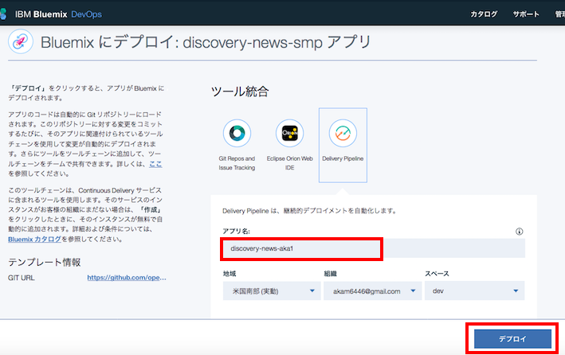
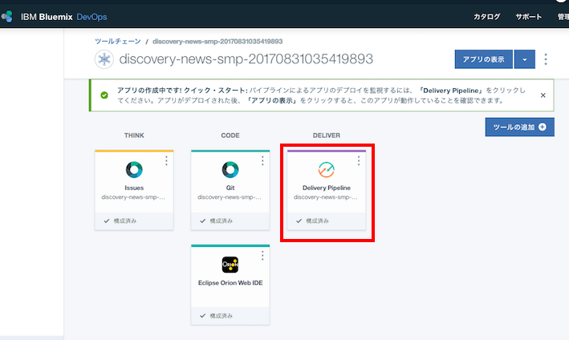
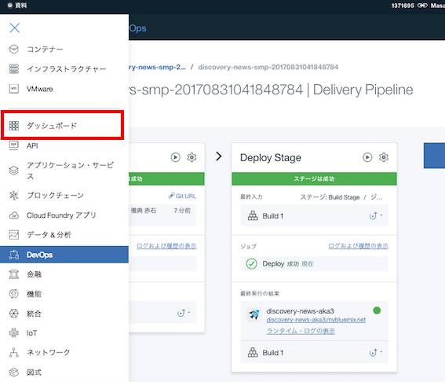
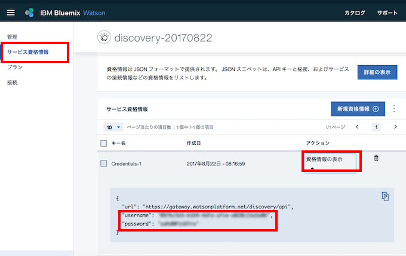
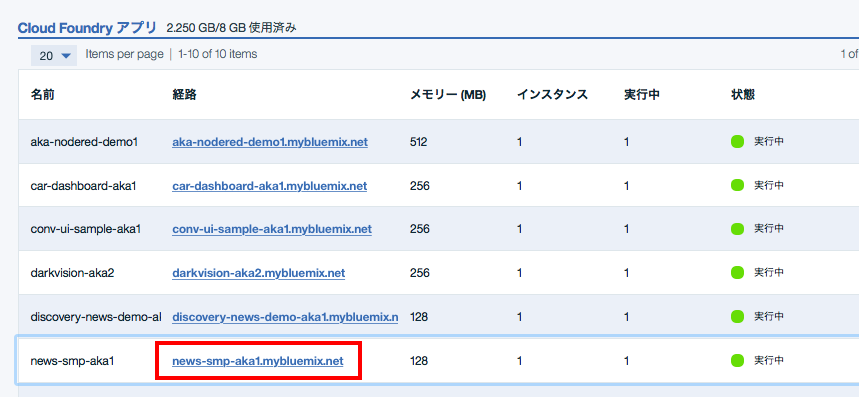

# Discovery News サンプルアプリケーション
このアプリケーションはWatson Discovery Newsの機能を簡単に確認するためのものです。  

* 次のようなことが可能です
    * 検索条件に会社名を入力し、その会社に関係するニュースの評判分析を行います
    * 検索時は、開始日、終了日を条件として指定できます
    * 検索結果は、日ごとに集計した好意的(青)、否定的(赤)、中立(黄色)の3本の折れ線グラフで表示されます
    * グラフ上の点にマウスポインタをあわせてクリックすると、評判の根拠になった記事へのリンクが右側に表示されます
    * 右側のリンクをクリックすると、元記事そのものに飛ぶことができます

デモ画面  


# Bluemix環境への自動導入
最も簡単にBluemix上にデモ環境を作りたい場合は、「自動導入」をお勧めします。  
その場合、以下の手順に従って下さい。 

## 事前準備
Bluemixアカウントを持っていない場合は [Bluemixアカウントを作る][sign_up] に従い、Bluemixアカウントを作成します。  
Bluemixアカウントを使って、 [Bluemixダッシュボード][bluemix_dashboard] を表示させて下さい。

## サービス・インスタンスの自動生成
  
- 次のボタンを押して下さい。

&nbsp;&nbsp;&nbsp;&nbsp;&nbsp;&nbsp;&nbsp;&nbsp;&nbsp;&nbsp;&nbsp;&nbsp; [](https://bluemix.net/deploy?repository=https://git.ng.bluemix.net/akaishi/discovery-news-smp)


- 下の画面が表示されたら「アプリ名」をわかりやすいものに変更し(アプリケーションのURLの一部になります) 、「デプロイ」ボタンをおします。

&nbsp;&nbsp;&nbsp;&nbsp;&nbsp;&nbsp;&nbsp;&nbsp;&nbsp;&nbsp;&nbsp;&nbsp;


* このボタンを押すことにより次の処理が自動的に行われます。
  - CloudFoundaryアプリケーションの作成
  - Watson APIサービスのDiscoveryインスタンスの作成
  - DiscoveryインスタンスとCloudFoundryアプリケーションのバインド
- 次の画面が表示されたら一番右の「Delivery Pipeline」を選択します。

&nbsp;&nbsp;&nbsp;&nbsp;&nbsp;&nbsp;&nbsp;&nbsp;&nbsp;&nbsp;&nbsp;&nbsp;

- Build StageとDeploy Stageの両方が「成功」となればアプリケーションのビルドは成功です。その場合、下の画面からダッシュボードの画面を表示します。

&nbsp;&nbsp;&nbsp;&nbsp;&nbsp;&nbsp;&nbsp;&nbsp;&nbsp;&nbsp;&nbsp;&nbsp;

- 赤枠で囲んだアプリケーションのリンクをクリックして、アプリケーションを起動します。  

&nbsp;&nbsp;&nbsp;&nbsp;&nbsp;&nbsp;&nbsp;&nbsp;&nbsp;&nbsp;&nbsp;&nbsp;


# Bluemixへの手動導入
より細かくBluemixの挙動を知りたい場合は、以下の「手動導入」の手順をお勧めします。  
「手動導入」には導入先により「ローカルへの導入」と「Bluemixへの導入」があります。  
「事前準備」はどちらの導入先を選ぶ場合も共通に必要な手順です。  

## 事前準備

### Bluemixアカウントの準備

[Bluemixアカウントを作る][sign_up] か、あるいは既存のBluemixアカウントを利用します。
### 前提ソフトの導入
次の前提ソフトを導入します。  
Node.jsはローカルでサーバーを動かす場合に必要となります。 

[gitコマンドラインツール][git]  
[Cloud Foundryコマンドラインツール][cloud_foundry]  
[Node.js][node_js] 
  
注意: Cloud Foundaryのバージョンは最新として下さい。 


### ソースのダウンロード
カレントディレクトリのサブディレクトリにソースはダウンロードされるので、あらかじめ適当なサブディレクトリを作り、そこにcdしておきます。
  

```
git clone https://git.ng.bluemix.net/akaishi/discovery-news-smp.git
```

### Discoveryサービスの作成
Bluemixにログインし、サービスの中からDiscovery Serviceを選んで作成します。  
  
  
  
  
サービス名は"discovery-service-1"、プランはデフォルトのlite(無料のもの)を選択します。  

    
  

## ローカル環境へのデプロイ

### プログラムの導入

次のコマンドを実行して必要なモジュールを導入します。

```
cd discovery-news-sample
npm install
```

### 認証情報の確認

Bluemixのダッシュボード画面から、前の手順で作成したDiscoveryサービスを選択し、サービス管理画面を表示します。  
「サービス資格情報」「資格情報の表示」をクリックし、ユーザーIDとパスワードをテキストエディタなどにコピーします。 
  
  

### 環境変数の設定

カレントディレクトリにあるlocal.env.sampleをlocal.envにコピーします。  
  
```
cp local.env.sample local.env
```
  
local.envをテキストエディタで開いて、下記の項目にそれぞれの値を設定して下さい。
    

```          
USERNAME=xxxxxxxx-xxxx-xxxx-xxxx-xxxxxxxxxxxx
PASSWORD=xxxxxxxxxxxx
```    
      
設定が完了したら、次のコマンドでnode.jsを起動します。
  
```
npm start
```

正常にNode.jsが起動できていれば、ブラウザから [http://localhost:6011][local_url] のURLでアプリケーションを起動できます。


## Bluemix環境へのデプロイ
### プログラムの配布

cf loginコマンドではemailとpasswordを聞かれるのでbluemix登録時のemailアドレスとパスワードを指定します。   
cf pushコマンドで指定する \<your\_appl\_name\> はBluemix上のインスタンス名であると同時に、インターネット上のURL名にもなるので、ユニークなものを指定します。  

```
cd discovery-news-sample
cf login
cf push <your_appl_name>
```
  
----------------------------
  
### アプリケーションのURLと起動
しばらくしてこれが完了したら、下記の画面で該当するCloud Foundaryアプリケーションの「経路」のリンクをクリックするとアプリケーションが起動されます。  




[node_js]: https://nodejs.org/#download
[cloud_foundry]: https://github.com/cloudfoundry/cli#downloads
[git]: https://git-scm.com/downloads
[sign_up]: https://bluemix.net/registration
[local_url]: http://localhost:6011
[bluemix_dashboard]: https://console.bluemix.net/dashboard/

