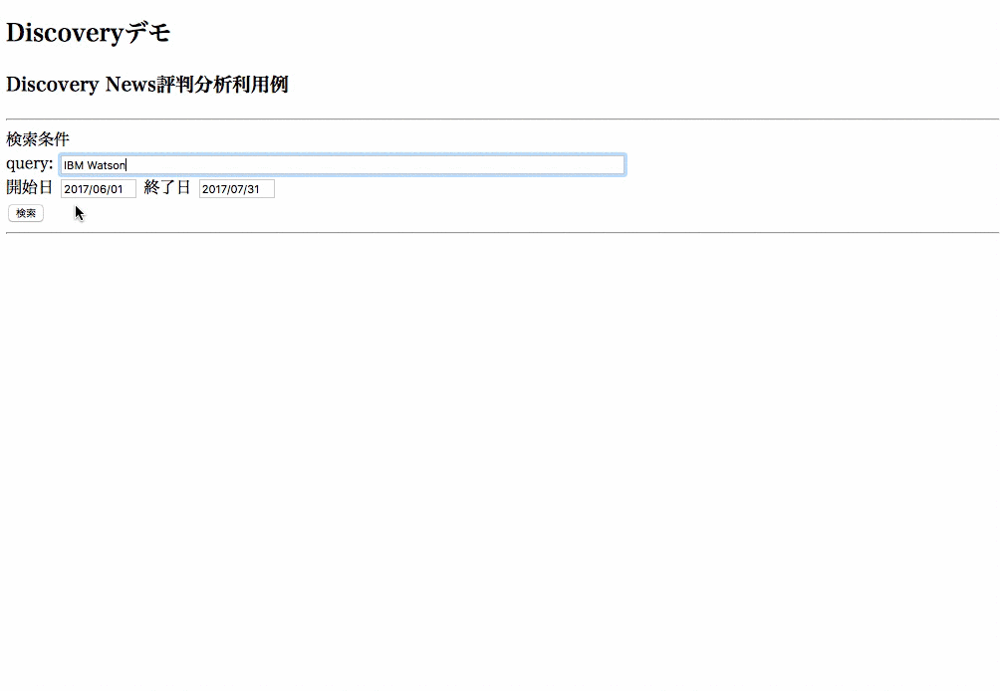

# Discovery News サンプルアプリケーション
Watson Discovery Newsは、情報検索・探索用APIであるWatson Discovery上にIBMが自ら世界中のニュースを収集し、情報サービスとして提供しているものです。  
このアプリケーションはWatson Discovery Newsの機能を簡単に確認するためのものです。  
(Discoveryは日本語対応済みですが、Discovery Newsは現時点では英語版のサービスとなっています)

* 次のようなことが可能です
    * 検索条件に会社名を入力し、その会社に関係するニュースの評判分析を行います
    * 検索時は、開始日、終了日を条件として指定できます
    * 検索結果は、日ごとに集計した好意的(青)、否定的(赤)、中立(黄色)の3本の折れ線グラフで表示されます
    * グラフ上の点にマウスポインタをあわせてクリックすると、評判の根拠になった記事へのリンクが右側に表示されます
    * 右側のリンクをクリックすると、元記事そのものに飛ぶことができます

デモ画面  


# 導入手順

## Bluemixアカウントの準備

[Bluemixアカウントを作る][sign_up] か、あるいは既存のBluemixアカウントを利用します。

## 前提ソフトの導入
次の前提ソフトを導入します。下記のリンク先からダウンロード後、それぞれ導入して下さい。

[gitコマンドラインツール][git]  
[Cloud Foundryコマンドラインツール][cloud_foundry]  
  
注意: Cloud Foundaryのバージョンは最新として下さい。 

## ソースのダウンロード
Githubからアプリケーションのソースをダウンロードします。  
カレントディレクトリのサブディレクトリにソースはダウンロードされるので、あらかじめ適当なサブディレクトリを作り、そこにcdしてから下記のコマンドを実行します。  
ダウンロード後、できたサブディレクトリにcdします。
 

```
$ cd (適当なサブディレクトリ)
$ git clone https://git.ng.bluemix.net/akaishi/discovery-news-sentiment.git
$ cd discovery-news-sentiment
```

## CFコマンドでログイン
CFコマンドでbluemix環境にログインします。ログイン名、パスワードはBluemixアカウント登録で登録したものを利用します。  
ログインに成功すると、次のような画面となります。  

```
$ cf login
```

  

## Discoveryサービスの作成
disocovery-1のサービスをまだ作成していない場合、以下のコマンドでDiscoveryサービスを作成します。
作成済みの場合、以下の手順は不要です。

```
$ cf create-service discovery lite discovery-1
$ cf create-service-key discovery-1 myKey
```

## アプリケーションのデプロイ

次のコマンドを実行します。
\<service_name\>はなんでもいいのですが、インターネット上のURLの一部となるので、ユニークな名前を指定します。  
(例) news-sentiment-aka1

```
$ cf push <service_name>
```

## アプリケーションのURLと起動

デプロイには数分かかります。デプロイが正常に完了したらアプリケーションを起動できます。  
次のURLをブラウザから指定して下さい。

```
https://<service_name>.mybluemix.net/
```

## アプリケーションを修正する場合

導入手順中、git cloneコマンドでダウンロードしたローカルリポジトリにアプリケーションのソースコードが入っています。アプリケーションを修正したい場合は、ローカルのソースを修正し、再度 "cf push \<service_name\>"コマンドを実行すると、Bluemix上のアプリケーションが更新されます。  
また、ローカルにNode.jsを導入すれば、"npm install"と"npm start"コマンドでローカルで開発・デバックを行うことも可能です。

[cloud_foundry]: https://github.com/cloudfoundry/cli#downloads
[git]: https://git-scm.com/downloads
[sign_up]: https://bluemix.net/registration
