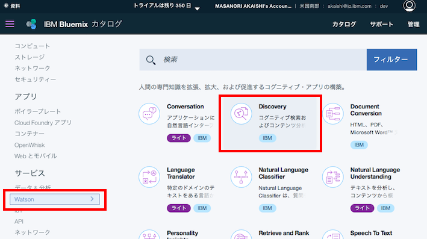
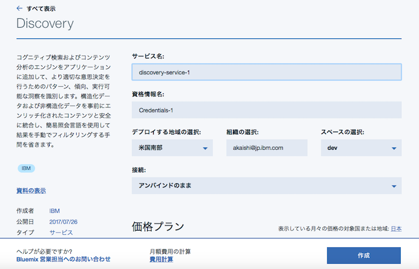
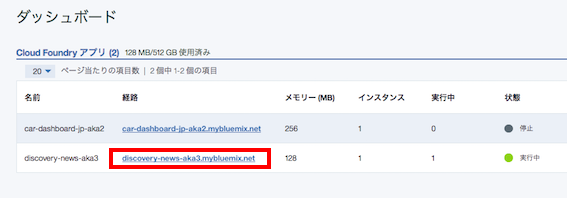

# Discovery News サンプルアプリケーション
このアプリケーションはWatson Discovery Newsの機能を簡単に確認するためのものです。  

* 次のようなことが可能です
    * 検索条件に会社名を入力し、その会社に関係するニュースの評判分析を行います
    * 検索時は、開始日、終了日を条件として指定できます
    * 検索結果は、日ごとに集計した好意的(青)、否定的(赤)、中立(黄色)の3本の折れ線グラフで表示されます
    * グラフ上の点にマウスポインタをあわせてクリックすると、評判の根拠になった記事へのリンクが右側に表示されます
    * 右側のリンクをクリックすると、元記事そのものに飛ぶことができます

デモ画面  

## 事前準備

* Bluemixアカウントの準備
    * [Bluemixアカウントを作る][sign_up] か、あるいは既存のBluemixアカウントを利用します。
* 次の前提ソフトを導入します。
    *  [git][git] コマンドラインツール
    *  [Cloud Foundry][cloud_foundry] コマンドラインツール

      注意: Cloud Foundaryのバージョンは最新として下さい。

### Discoveryサービスの作成
Bluemixにログインし、サービスの中からDiscovery Serviceを選んで作成します。  
  
  
  
サービス名は discovery-service-1を指定し、プランはデフォルトの無料のものを選択します。  
  
  
  
### ソースのダウンロード
カレントディレクトリのサブディレクトリにソースはダウンロードされるので、あらかじめ適当なサブディレクトリを作り、そこにcdしておきます。

    git clone https://git.ng.bluemix.net/akaishi/discovery-news-aka1.git

### Bluemix環境へのデプロイ
cf loginコマンドではemailとpasswordを聞かれるのでbluemix登録時のemailアドレスとパスワードを指定します。  
cf pushコマンドで指定する<your_appl_name>はBluemix上のインスタンス名であると同時に、インターネット上のURL名にもなるので、ユニークなものを指定します。  

    cd conv-ui-sample
    cf login
    cf create-service discovery free my-discovery-service
    cf push <your_appl_name>

### アプリケーションのURLと起動
環境変数を保存すると自動的に再構成が動き出します。  
しばらくしてこれが完了したら、下記の画面で該当するCloud Foundaryアプリケーションの「経路」のリンクをクリックするとアプリケーションが起動されます。

[cloud_foundry]: https://github.com/cloudfoundry/cli#downloads
[git]: https://git-scm.com/downloads
[sign_up]: https://bluemix.net/registration
